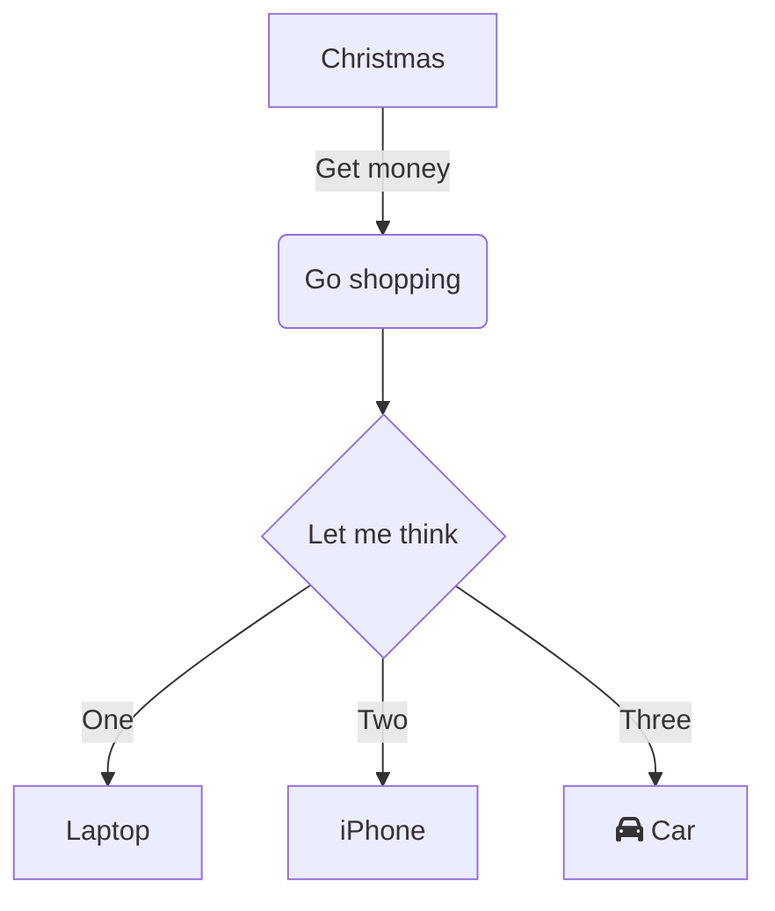
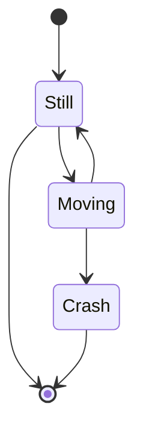
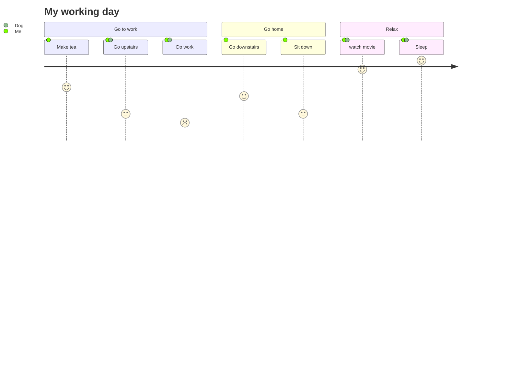

> This is a test page to try out Jekyll, and it's a pinned post.
{: .prompt-info}

# Introduction

This page is meant to test out features explained in the [chirpy docs](https://chirpy.cotes.page/posts/write-a-new-post/);

## Github stats for fun

[](https://github.com/dinghino/dinghino.github.io)
[](https://github.com/dinghino/TicToc)
[](https://github.com/dinghino/stocks-historical-data)

[](https://github.com/dinghino){: .normal}
[](https://github.com/dinghino)
[](https://github.com/dinghino)


## A sub header to try out stuff

Filepath highlight is done like this `/path/to/a/file.extend`{: .filepath}

while codeblocks follow the same standard, but are fancily styled!
```markdown
`/path/to/a/file.extend`{: .filepath}
```

```typescript
import { createControlsMachine } from "./machines/Controls";
import { config } from "./config";
import { interpret } from "xstate";

const machine = createControlsMachine(config);

const service = interpret(machine)
  .start();

export default service;
```
## Mermaid integration

These fancy diagram has been built with [mermaid](https://github.com/mermaid-js/mermaid) and their [live editor]()


### You can make state diagrams...

### ...Journey diagrams and so more

